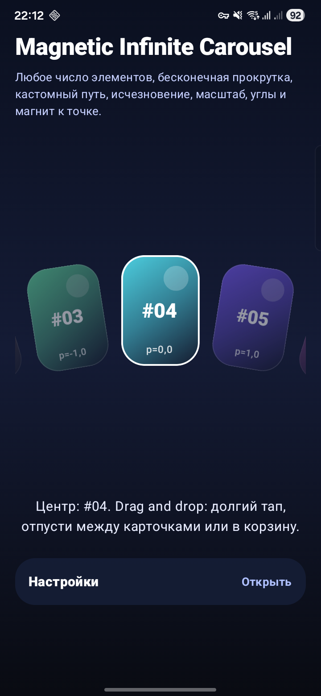
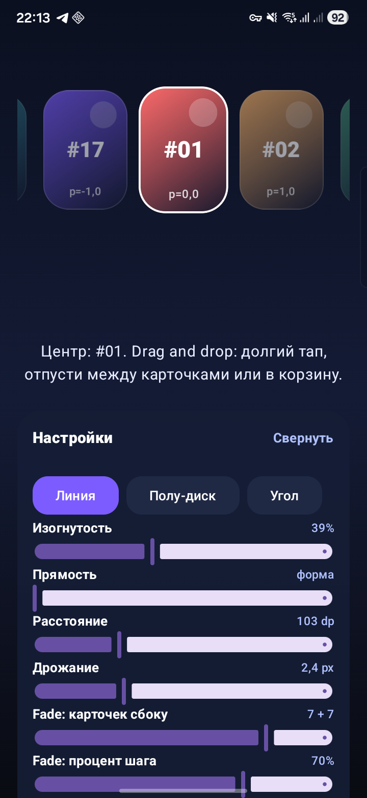

# CarouselCompose

An advanced Android/Jetpack Compose library implementing an **Infinite Magnetic Carousel** component with customizable paths, transforms, and gesture support.


---

## Features

- **Infinite scrolling** with seamless looping and magnetic snap-to-item
- **Three built-in path types**: straight line, arc/semi-disc, and morphing between two paths
- **Rich item transforms**: scale, alpha, rotation (Z & Y axes), z-index, and jitter animations
- **Gesture support**: drag, fling, tap-to-center, and long-press drag-and-drop reordering
- **Drag & Drop**: reorder cards or drag to a trash zone for deletion, with real-time previews
- **Haptic feedback** on scroll and interactions
- **Fully reusable** core component — drop it into any Compose project

---

## Demo

The bundled demo app showcases three carousel modes with a live settings panel:

| Carousel | Settings panel |
|----------|---------------|
|  |  |

| Mode | Description |
|------|-------------|
| **Line** | Straight horizontal arrangement |
| **Semi-Disc** | Curved arc layout |
| **Angled** | Tilted line arrangement |

Real-time controls let you adjust curvature, spacing, jitter, fade distance, and sticky-bounce — all without restarting the app.

---

## Project Structure

```
CarouselCompose/
└── app/src/main/java/com/example/carousel/
    ├── MainActivity.kt                  # Application entry point
    ├── carousel/                        # Core reusable component
    │   ├── InfiniteMagneticCarousel.kt  # Main composable
    │   ├── MagneticCarouselState.kt     # State & animation management
    │   ├── CarouselPaths.kt             # Line / Arc / Morph path definitions
    │   ├── CarouselTransforms.kt        # Transform configuration DSL
    │   └── CarouselMath.kt              # Math utilities (lerp, floorMod, …)
    └── demo/                            # Interactive demo application
        ├── CarouselApp.kt               # Root demo composable
        ├── DemoCard.kt                  # Card UI component
        ├── DemoControls.kt              # Sliders & action buttons
        ├── DemoAnimations.kt            # Animation helpers
        ├── DemoHaptics.kt               # Vibration feedback
        └── DemoModels.kt                # Data models & card colours
```

---

## Requirements

- **Android Studio** (latest stable recommended)
- **JDK 17** or higher
- **Android SDK** with API level 36 installed
- A physical device or emulator running **Android 7.0+ (API 24+)**

---

## Getting Started

### 1. Clone the repository

```bash
git clone https://github.com/your-username/CarouselCompose.git
cd CarouselCompose
```

### 2. Configure the Android SDK path (if needed)

Edit `local.properties`:

```properties
sdk.dir=/path/to/your/android/sdk
```

### 3. Build & run

```bash
# Build a debug APK
./gradlew assembleDebug

# Install directly on a connected device / running emulator
./gradlew installDebug

# Clean the build directory
./gradlew clean
```

Or simply open the project in **Android Studio** and click **Run ▶**.

---

## Usage

### Basic setup

```kotlin
val state = rememberMagneticCarouselState(initialIndex = 0)

InfiniteMagneticCarousel(
    items = myItems,
    state = state,
    itemSize = DpSize(94.dp, 132.dp),
    path = ArcCarouselPath(
        radiusDp = 300f,
        degreesPerItem = 15f,
        centerOffsetDp = Offset(0f, 400f)
    ),
    gestureConfig = CarouselGestureConfig(),
    transform = { progress ->
        CarouselItemTransform(
            scale = lerp(0.75f, 1f, 1f - abs(progress)),
            alpha = lerp(0.4f, 1f, 1f - abs(progress))
        )
    },
    itemContent = { item, _, progress ->
        MyCardComposable(item = item)
    }
)
```

### Available paths

| Class | Description |
|-------|-------------|
| `LineCarouselPath` | Items arranged along a straight (optionally angled) line |
| `ArcCarouselPath` | Items placed on a circular arc |
| `MorphCarouselPath` | Blends smoothly between any two `CarouselPath` instances |

### State control

```kotlin
// Animate to a specific index
state.animateTo(index = 3)

// Snap without animation
state.scrollTo(index = 0)

// Read the current centred index
val current = state.currentIndex
```

---

## Tech Stack

| Library | Version |
|---------|---------|
| Kotlin | 2.2.21 |
| Jetpack Compose BOM | 2025.10.01 |
| Material3 | BOM-managed |
| Activity Compose | 1.11.0 |
| Android Gradle Plugin | 8.13.1 |
| Java target | 17 |

---

## Permissions

```xml
<!-- Required for haptic feedback on Android < 12 -->
<uses-permission android:name="android.permission.VIBRATE" />
```

---

## License

This project is open source. See [LICENSE](LICENSE) for details.
